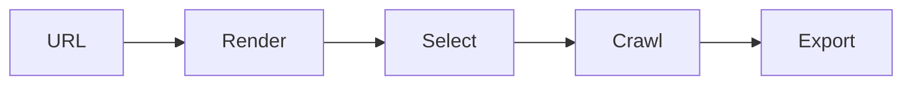

# ws-desktop-tool 🕷️⚡

  

*Point it at a page, walk away, come back to structured data.*

  

## 🔍 Overview

ws-desktop-tool is a native Windows application for pulling structured data off websites without touching a terminal, a script, or a cloud dashboard. Web Scraper Desktop was built on a simple premise: extraction shouldn't require an engineering degree. Open the app, point it at a target, define what you want, hit start. That's the whole learning curve.

Most scraping tools force a choice — powerful-but-code-heavy frameworks, or shallow browser extensions that choke on real websites. ws-desktop-tool sits in the middle. It renders pages like a real browser, handles pagination and infinite scroll, and exports clean tables — while staying a single installable app with zero setup ceremony. No package managers, no runtime installs, no config files to hand-edit before your first successful pull.

It's built for researchers cataloguing sources, small businesses tracking competitor pricing, marketers building lead lists, and hobbyists who just want a spreadsheet out of a website. If you've ever copy-pasted table rows by hand at 1AM, this exists so you never do that again.

---

## 🧩 What It Actually Does

- **Visual point-and-click selectors** — click the data you want on the rendered page; no CSS selectors or XPath required unless you want them.

- **Pagination auto-detection** — recognizes "Next" buttons, numbered pages, and infinite scroll, then chains extraction across all of them.

- **Scheduled runs** — set a scraper to fire hourly, daily, or weekly and let it build a dataset over time unattended.

- **Multi-format export** — CSV, JSON, and Excel out of the box, ready for a spreadsheet or a database import.

- **Built-in rendering engine** — handles JavaScript-heavy pages the same way a browser tab does, so dynamic content isn't invisible to your scrape.

- **Proxy rotation slots** — plug in your own proxy list to spread requests and reduce rate-limit friction on larger jobs.

- **Template library** — reusable scraper blueprints for common site patterns (listings, tables, product grids) so you're not starting from a blank canvas every time.

- **Local-first data storage** — everything lives on your machine by default; nothing is uploaded unless you explicitly export it somewhere.

> [!TIP]
> Start with a Template before building a custom selector from scratch — most listing and table sites match an existing pattern.

---

## 🚀 How To Get Started

1. Visit the landing page via the download button above.

2. Grab the latest Windows build — no account, no email gate.

3. Run the installer and launch ws-desktop-tool from your Start Menu.

4. Paste a URL, click through the elements you want, hit **Start Scrape**.

> [!NOTE]
> First run may take a few extra seconds while the rendering engine initializes. Subsequent launches are near-instant.

---

## 💻 System Requirements

| Requirement | Minimum |
|---|---|
| OS | Windows 10 (64-bit) or Windows 11 |
| RAM | 4 GB (8 GB recommended for large multi-page jobs) |
| Disk | 300 MB free space |
| Dependencies | None — fully standalone |
| Internet | Required for scraping targets, not for the app itself |

  

---

## ⚙️ How It Works

1. **Target lock** — you feed it a URL; the internal renderer loads the page exactly as a browser would.

2. **Selection map** — clicking elements builds an internal map of what data lives where on the DOM.

3. **Crawl logic** — the engine walks pagination or scroll triggers, repeating the selection map on every new page.

4. **Extraction pass** — matched data gets pulled, cleaned of stray whitespace/tags, and structured into rows.

5. **Export** — you choose CSV, JSON, or Excel, and the dataset lands wherever you point it.

> [!IMPORTANT]
> Sites change their layout over time. If a long-running scraper suddenly returns empty rows, re-check the selection map first — that's the most common cause.

---

## 🧯 Troubleshooting

<strong>The scraper returns empty results on a page that clearly has data</strong>

The site likely loads content after an initial delay. Increase the render wait time in scraper settings — most JS-heavy sites finish painting within 2-4 seconds.

<strong>Pagination stops after the first page</strong>

Auto-detection may have missed a custom "Load More" button. Switch to manual pagination mode and click the trigger element yourself once — the app remembers it.

<strong>Export file is missing some columns</strong>

A column is likely inconsistent across pages (present on some, absent on others). Enable "fill missing as blank" in export settings instead of skipping the row entirely.

<strong>The app is being throttled or blocked by a target site</strong>

Slow the request interval in scraper settings and enable proxy rotation if you've configured one. Aggressive request rates are the top cause of temporary blocks.

<strong>Scheduled run didn't execute</strong>

Check that the app isn't fully closed to tray — scheduled jobs require it running in the background. Confirm this under Settings → Scheduler.

> [!WARNING]
> Always respect a site's terms of service and robots.txt before scraping it. This tool provides capability, not permission.

---

## 🎨 UI / UX Details

- **Themes** — Light, Dark, and an auto mode that follows your Windows theme setting.

- **Keyboard shortcuts**:

  | Action | Shortcut |
  |---|---|
  | New scraper | `Ctrl + N` |
  | Start / Stop run | `Ctrl + R` |
  | Export current dataset | `Ctrl + E` |
  | Toggle selector overlay | `Ctrl + Shift + S` |
  | Settings panel | `Ctrl + ,` |

- **Settings persistence** — every scraper config, proxy list, and export path is saved locally and reloads automatically on next launch.

- **Live preview pane** — see extracted rows populate in real time as the crawl runs, instead of waiting blind for a finished job.

---

## 🤝 Contributing & Community

Bug reports, feature requests, and template contributions are welcome via Issues and Pull Requests. Before opening a PR:

> [!TIP]
> Small, focused PRs merge faster than large rewrites. If you're adding a new export format or selector type, open an issue first to align on approach.

- Fork, branch, commit with clear messages.
- Describe *why* a change matters, not just *what* changed.
- Be respectful in reviews — this project is maintained by volunteers in their spare time.

---

## 📜 License

Released under the [MIT License](LICENSE), 2026. Use it, fork it, ship it — just keep the license notice intact.

---

## ⚠️ Disclaimer

ws-desktop-tool is provided for legitimate data collection, research, and automation purposes. Users are solely responsible for complying with applicable laws, third-party terms of service, and robots.txt directives when scraping any website. The maintainers assume no liability for misuse.

---

